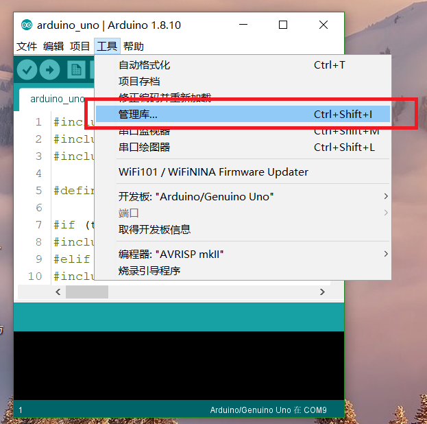
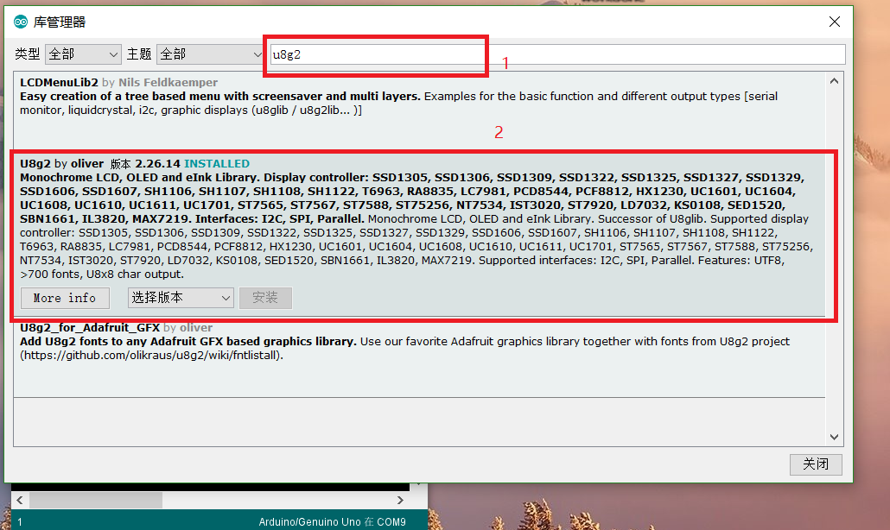

# OLED_Arduino
[preparation](#preparation)       [准备工作](#准备工作)

#### preparation

​	***If you want to modify the code to became other models, you must have make sure already installed [Arduino](https://www.arduino.cc/en/Main/Software) software on your computer.***

​	***You need download a library named  "u8g2"  on your [Arduino](https://www.arduino.cc/en/Main/Software)*** .

*download method:*

####  File composition

***OLED***

- ***SSD1306***
  - ***IIC-------      UNO ,         [ESP32(Wireless Stick Lite)](https://heltec.org/project/wireless-stick-lite/)***
  - ***SPI------      UNO ,         [ESP32(Wireless Stick Lite)](https://heltec.org/project/wireless-stick-lite/)***
- ***SH1306***
  - ***IIC-------      UNO ,        [ESP32(Wireless Stick Lite)](https://heltec.org/project/wireless-stick-lite/)***
  - ***SPI------      UNO ,        [ESP32(Wireless Stick Lite)](https://heltec.org/project/wireless-stick-lite/)***

简体中文

#### 准备工作

​	1）如果你想要以修改代码的形式选择其他型号的显示屏，你必须确保你的电脑上已经安装了[Arduino](https://www.arduino.cc/en/Main/Software) 软件。

​	2）你还需要在你的 [Arduino](https://www.arduino.cc/en/Main/Software)上面安装一个叫做“u8g2” 的库。

库的安装方法：

#### 文件位置分布

***OLED***

- ***SSD1306***
  - ***IIC-------      UNO ,         [ESP32(Wireless Stick Lite)](https://heltec.org/project/wireless-stick-lite/)***
  - ***SPI------      UNO ,         [ESP32(Wireless Stick Lite)](https://heltec.org/project/wireless-stick-lite/)***
- ***SH1306***
  - ***IIC-------      UNO ,        [ESP32(Wireless Stick Lite)](https://heltec.org/project/wireless-stick-lite/)***
  - ***SPI------      UNO ,        [ESP32(Wireless Stick Lite)](https://heltec.org/project/wireless-stick-lite/)***

